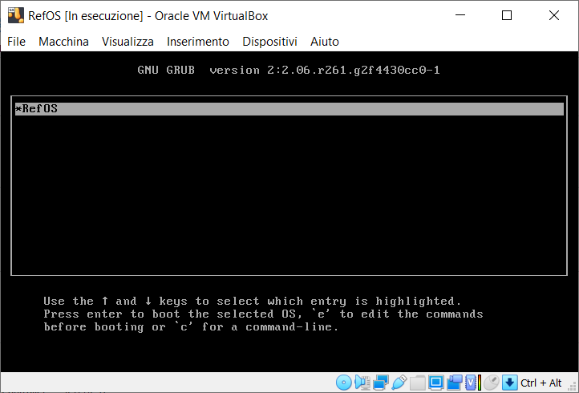
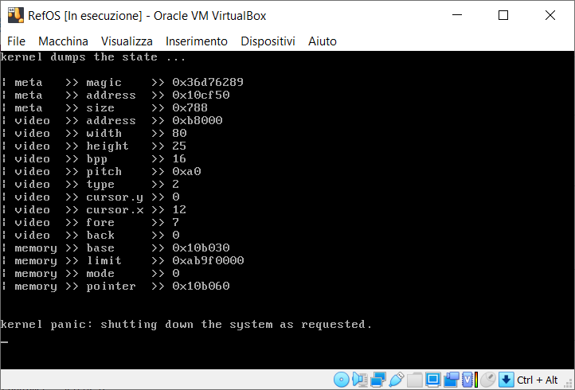

# RefOs

Handmade bare operative system.

## Build instructions

To build the `./build/os.iso` just call `make clean config compile`.

## Emulation instructions

To run the built iso, call either:

- `make bochs`, to call Bochs as Virtualizer

- `make run`, to call Qemu as Virtualizer

## State of Art

### Grub

### Boot

